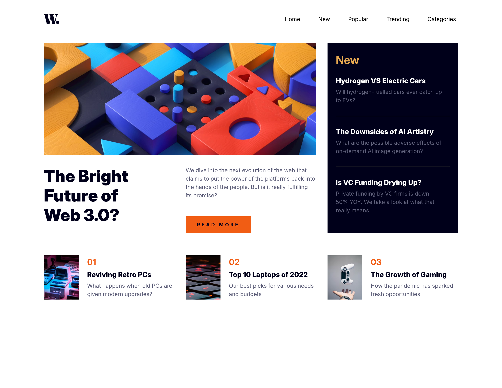

# Frontend Mentor - News homepage solution

This is a solution to the [News homepage challenge on Frontend Mentor](https://www.frontendmentor.io/challenges/news-homepage-H6SWTa1MFl). Frontend Mentor challenges help you improve your coding skills by building realistic projects. 

## Table of contents

- [Overview](#overview)
  - [The challenge](#the-challenge)
  - [Screenshot](#screenshot)
  - [Links](#links)
- [My process](#my-process)
  - [Built with](#built-with)
  - [What I learned](#what-i-learned)
  - [Continued development](#continued-development)
  - [Useful resources](#useful-resources)
- [Author](#author)

## Overview

### The challenge

Users should be able to:

- View the optimal layout for the interface depending on their device's screen size
- See hover and focus states for all interactive elements on the page

### Screenshot

### Links

[Live Site](https://s2i61m97o.github.io/news-homepage/)

## My process

### Built with

- Semantic HTML5 markup
- SASS
- Flexbox
- CSS Grid
- Mobile-first workflow

### What I learned

- How to create a hamburger menu
- Practise with using Grid for layouts - I tend to favour Flexbox.
- I also used the [Responsively App](https://responsively.app/) for the first time, which makes it a lot easier to view your project across multiple screen sizes at once and the effects changes make to those different screen sizes.

### Continued development

- Practise using Grid and Flexbox in layout
- Continue to use Responsively in development

### Useful resources

- [This article on dev.to](https://dev.to/ljcdev/easy-hamburger-menu-with-js-2do0) helped with understanding how to create a simple hamburger menu

## Author

- Frontend Mentor - [@s2i61m97o](https://www.frontendmentor.io/profile/s2i61m97o)

